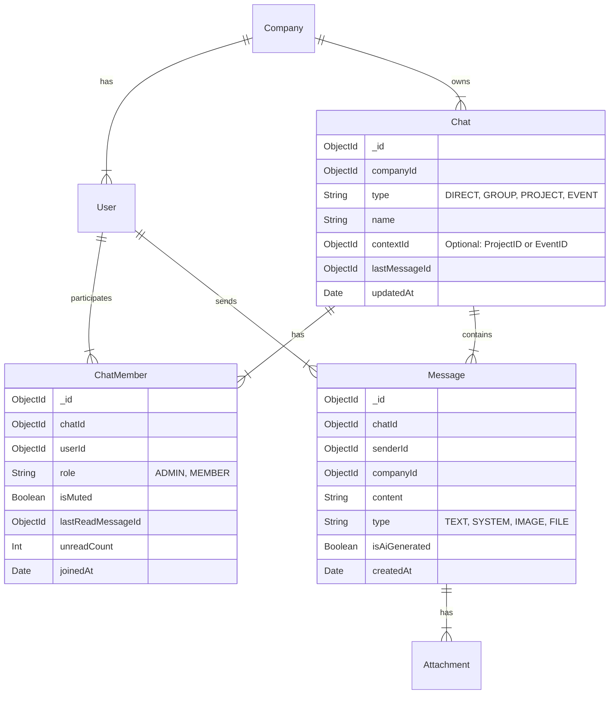

# Technical Design: Organization-Scoped Chat System

## 1. Executive Summary

This document outlines the technical architecture for upgrading the current basic messaging feature into a full-featured, organization-scoped chat system. The goal is to provide a robust communication platform similar to WhatsApp or Slack, but scoped strictly within a company tenant.

**Key Features:**
- **Organization Scoping:** All chats are strictly isolated to the user's company.
- **Chat Types:** Support for 1:1 Direct Messages, Group Chats, and Context-based Chats (Project/Event).
- **Real-time Interaction:** Typing indicators, read receipts, and live message updates.
- **Rich Media:** File attachments and image sharing.
- **User Controls:** Mute settings per chat, admin presence in all chats.
- **Presence:** Online/Offline/DND status tracking.

## 2. Data Model Architecture

The current data model relies on `Message` entities directly linked to `Project` or `Event`. We will introduce a `Chat` entity to serve as the container for all conversations, normalizing the structure.

### 2.1 Entity Relationship Diagram



### 2.2 Schema Definitions

#### Chat Schema
The central container for conversations.
```javascript
const chatSchema = new Schema({
  companyId: { type: Schema.Types.ObjectId, ref: 'Company', required: true },
  type: { 
    type: String, 
    enum: ['DIRECT', 'GROUP', 'PROJECT', 'EVENT'], 
    required: true 
  },
  name: { type: String }, // For groups/projects/events. Null for 1:1 (derived from participants)
  contextId: { type: Schema.Types.ObjectId }, // Ref to Project or Event if type is PROJECT/EVENT
  lastMessage: { type: Schema.Types.ObjectId, ref: 'Message' }, // Optimization for list view
  lastMessageAt: { type: Date, default: Date.now }, // For sorting
  creatorId: { type: Schema.Types.ObjectId, ref: 'User' },
  isArchived: { type: Boolean, default: false }
}, { timestamps: true });

// Compound index for efficient user chat list retrieval is handled via ChatMember, 
// but we index companyId for safety.
chatSchema.index({ companyId: 1 });
```

#### ChatMember Schema
Join table handling many-to-many relationship between Users and Chats, plus user-specific settings.
```javascript
const chatMemberSchema = new Schema({
  chatId: { type: Schema.Types.ObjectId, ref: 'Chat', required: true },
  userId: { type: Schema.Types.ObjectId, ref: 'User', required: true },
  role: { type: String, enum: ['admin', 'member'], default: 'member' },
  isMuted: { type: Boolean, default: false },
  lastReadMessageId: { type: Schema.Types.ObjectId, ref: 'Message' },
  lastReadAt: { type: Date, default: Date.now }
}, { timestamps: true });

chatMemberSchema.index({ userId: 1, chatId: 1 }, { unique: true }); // One membership per chat
chatMemberSchema.index({ chatId: 1 });
```

#### Message Schema (Refactored)
Updated to point to `Chat` instead of `Project/Event`.
```javascript
const messageSchema = new Schema({
  chatId: { type: Schema.Types.ObjectId, ref: 'Chat', required: true, index: true },
  senderId: { type: Schema.Types.ObjectId, ref: 'User', required: true },
  companyId: { type: Schema.Types.ObjectId, ref: 'Company', required: true },
  content: { type: String }, // Can be empty if only attachment
  attachments: [{
    url: String,
    filename: String,
    mimeType: String,
    size: Number
  }],
  isAiGenerated: { type: Boolean, default: false },
  metadata: { type: Map, of: String } // Extensible field
}, { timestamps: true });

messageSchema.index({ chatId: 1, createdAt: -1 }); // For pagination
```

## 3. GraphQL Schema Design

We will extend the current schema with new types and operations.

### 3.1 Types

```graphql
enum ChatType {
  DIRECT
  GROUP
  PROJECT
  EVENT
}

type Attachment {
  url: String!
  filename: String!
  mimeType: String!
  size: Int!
}

type Chat {
  id: ID!
  type: ChatType!
  name: String
  members: [ChatMember!]!
  lastMessage: Message
  unreadCount: Int # Computed for current user
  createdAt: Date!
  updatedAt: Date!
}

type ChatMember {
  user: User!
  role: String!
  isMuted: Boolean!
  lastReadAt: Date
}

extend type Message {
  chat: Chat!
  attachments: [Attachment!]
  readBy: [User!] # Computed from ChatMembers
}

type TypingIndicator {
  chatId: ID!
  user: User!
  isTyping: Boolean!
}
```

### 3.2 Operations

#### Queries
```graphql
type Query {
  # Get all chats for the current user
  getChats: [Chat!]!
  
  # Get a specific chat (verifying membership)
  getChat(id: ID!): Chat
  
  # Get messages for a chat with pagination
  getChatMessages(chatId: ID!, limit: Int, offset: Int): [Message!]!
  
  # Find or create a 1:1 chat
  getDirectChat(userId: ID!): Chat!
}
```

#### Mutations
```graphql
type Mutation {
  # Create a new group chat
  createGroupChat(name: String!, memberIds: [ID!]!): Chat!
  
  # Update chat settings (e.g., mute)
  updateChatSettings(chatId: ID!, isMuted: Boolean!): ChatMember!
  
  # Send a message (supports file upload via signed URL flow separately)
  sendMessageToChat(chatId: ID!, content: String, attachments: [AttachmentInput]): Message!
  
  # Mark messages as read up to a specific point
  markChatAsRead(chatId: ID!, messageId: ID!): Boolean!
  
  # Generate a signed URL for file upload (S3)
  getUploadUrl(filename: String!, mimeType: String!): String!
  
  # Add members to a group
  addMembersToChat(chatId: ID!, memberIds: [ID!]!): Chat!
}
```

#### Subscriptions
```graphql
type Subscription {
  # Fired when a new message arrives in any of the user's chats
  messageAddedToChat: Message!
  
  # Fired when typing status changes in a chat the user is part of
  userTyping(chatId: ID!): TypingIndicator!
  
  # Fired when a chat is updated (new last message, member added, etc.)
  chatUpdated: Chat!
}
```

## 4. Real-time Strategy

### 4.1 PubSub Channels
We will use `GraphQL PubSub` (backed by Redis in production, in-memory for dev) with filtering.

*   `MESSAGE_ADDED`: Payload `{ message, receiverIds }`. 
    *   *Filter:* `receiverIds.includes(currentUser.id)`
*   `CHAT_UPDATED`: Payload `{ chat, memberIds }`.
    *   *Filter:* `memberIds.includes(currentUser.id)`
*   `TYPING_STATUS`: Payload `{ chatId, userId, isTyping }`.
    *   *Filter:* User is member of `chatId`.

### 4.2 Presence
User presence (Online/Away/Offline) will be handled via a heartbeat mechanism over the WebSocket connection or a simple "last seen" timestamp updated on user activity.
*   **Frontend:** Sends a heartbeat mutation/subscription update every X minutes.
*   **Backend:** Stores `lastSeenAt` in User model or Redis.
*   **Schema:** `User` type gets `isOnline` computed field (e.g., `lastSeenAt > 5 mins ago`).

### 4.3 Typing Indicators
*   **Client:** Debounce typing events (e.g., send "start" after 300ms typing, "stop" after 2s idle).
*   **Server:** Broadcasts `userTyping` subscription event to chat members.
*   **Optimization:** Do not persist typing status to DB; purely ephemeral.

## 5. File Upload Flows

### 5.1 Strategy
We will use a **Signed URL** approach for scalability and security, but support a fallback for local development.

1.  **Request:** Client calls `getUploadUrl(filename, mimeType)`.
2.  **Generation:** 
    *   *Prod:* Server generates AWS S3 Pre-signed PUT URL.
    *   *Dev:* Server generates a local API URL (e.g., `/api/uploads/...`).
3.  **Upload:** Client performs `PUT` to the URL with binary data.
4.  **Confirmation:** Client calls `sendMessageToChat` with the resulting file URL/Path as an attachment.

### 5.2 Local Storage (Dev)
*   `uploads/` directory served statically by Express.
*   `ContainerCreationAgent` ensures permissions.

## 6. Frontend UX/UI Plan

### 6.1 Layout
*   **Sidebar (Left):**
    *   **Header:** User Profile, "New Chat" button.
    *   **Search:** Filter chats by name.
    *   **List:** Scrollable list of `Chat` items.
        *   *Chat Item:* Avatar, Name, Last Message snippet, Timestamp, Unread Badge.
        *   *Online Indicator:* Green dot on avatar.
*   **Main View (Center):**
    *   **Header:** Chat Name, Member count, Mute toggle.
    *   **Message List:** Grouped by date. 
        *   *Bubbles:* Differing styles for "Me" vs "Others".
        *   *Read Receipts:* Double checkmarks (Blue=Read).
    *   **Composer:** Text input, Emoji trigger, Attachment paperclip.
        *   *Typing Bar:* "Alice is typing..." just above input.
*   **Info Panel (Right - Collapsible):**
    *   Members list (with admin controls).
    *   Shared media gallery.

### 6.2 Interactions
*   **Live Updates:** Use Apollo `useSubscription` to update the cache directly.
*   **Infinite Scroll:** `fetchMore` for messages history.
*   **Optimistic UI:** Immediate feedback on "Send", showing "Sending..." status.

## 7. Security & Authorization

1.  **Company Isolation:**
    *   Every query MUST filter by `companyId` from the JWT context.
    *   Users can NEVER add members from a different company.
2.  **Chat Access:**
    *   Middleware checks `ChatMember` existence for `getChatMessages`.
    *   Admins have a "Super View" but functionally join chats as needed.
3.  **Admin Privileges:**
    *   Company Admins cannot be removed from chats (validation rule).
    *   Company Admins can delete any message in their company scope.

## 8. Migration Strategy (Backward Compatibility)

Since we are changing from `Message.projectId` to `Message.chatId`:

1.  **Step 1: Database Migration Script**
    *   Iterate over all existing `Projects` and `Events`.
    *   For each, create a corresponding `Chat` document:
        *   `type`: 'PROJECT' / 'EVENT'
        *   `contextId`: Project/Event ID.
        *   `members`: Project/Event members.
    *   Iterate over existing `Messages`.
    *   Map `Message.projectId` -> `NewChat.id`.
    *   Update `Message` documents with `chatId`.

2.  **Step 2: Code Compatibility**
    *   Deprecate `sendMessage(projectId: ...)` mutation.
    *   Update it to internally find the Project Chat and route logic to the new Chat system.

3.  **Step 3: Cleanup**
    *   Remove `projectId` / `eventId` fields from Message schema in a future release.

## 9. Implementation Checklist

- [ ] Create `Chat` and `ChatMember` Mongoose models.
- [ ] Update `Message` Mongoose model.
- [ ] Implement `getUploadUrl` resolver (S3/Local switch).
- [ ] Implement `Chat` GraphQL TypeDefs and Resolvers.
- [ ] Refactor `sendMessage` to support Attachments and Chat ID.
- [ ] Create Migration Script `scripts/migrate_messages_to_chats.js`.
- [ ] Frontend: Create `ChatList` and `ChatRoom` components.
- [ ] Frontend: Integrate Subscriptions for real-time updates.
